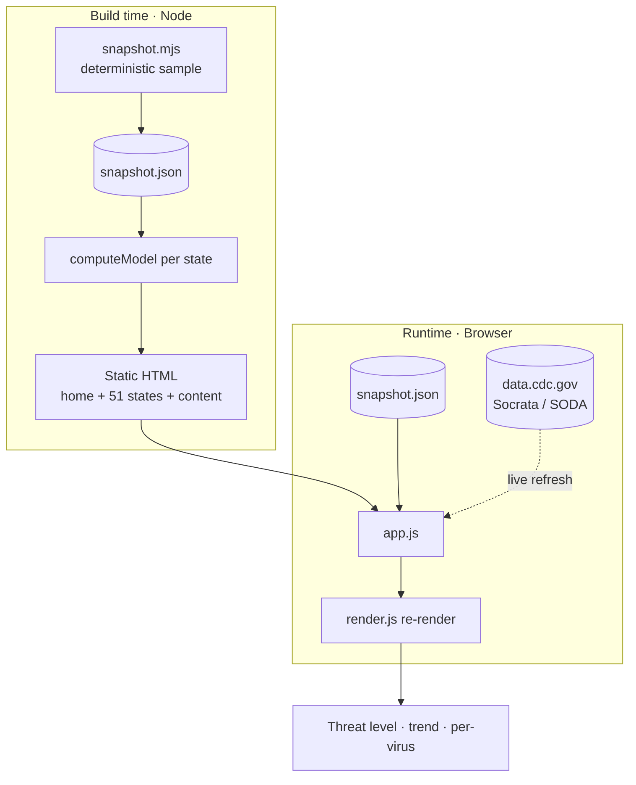

# FluTrack architecture

FluTrack is a dependency-free static site with a small Node build. This document
covers the data flow, the scoring model, and the rendering strategy.

## Data flow



The **same** `render.js` functions run at build time and in the browser, so the
statically generated markup and the live-refreshed markup are identical.

## The unified Respiratory Threat Level

Implemented in `src/scripts/threat-index.js` (pure, fully unit-tested).

1. **Normalize** each available signal to a 0–100 score via piecewise-linear
   breakpoints (`scoreFromBreakpoints`).
2. **Composite** = weighted average over the signals actually present, weights
   renormalized:

   | Signal | Weight | Why |
   |--------|-------:|-----|
   | Wastewater (WVAL) | 0.30 | Leads clinical reporting ~5–7 days |
   | ARI activity level | 0.25 | CDC's own categorical read |
   | ED visits (% combined) | 0.25 | Timely, population-scale |
   | Test positivity | 0.20 | Reflects testing behavior, not prevalence |

3. **Bucket** the composite into five levels: `<20` Minimal, `<40` Low,
   `<60` Moderate, `<80` High, `≥80` Very High.
4. **Trend** compares the latest value to the mean of the prior up-to-3 weeks;
   `≥ +8%` Rising, `≤ −8%` Falling, otherwise Holding steady.

Per-pathogen scores use the same machinery with pathogen-specific breakpoints.
These thresholds are FluTrack's transparent editorial choices — not CDC-defined
cut points — and are published on `/methodology/`.

## Compliance guardrails (by design)

- **No medical advice.** Copy is generated to describe data only; the tone rules
  are enforced in every template and documented on `/medical-disclaimer/`.
- **Trend, not live.** The 1–2 week reporting lag is surfaced in the UI and the
  data provenance badge ("Live CDC data" vs "Sample data").
- **Licensing.** `excludeNonCommercial()` drops any wastewater row sourced from
  WastewaterSCAN / SCAN / Verily (CC BY-NC 4.0) before it can reach the UI.
- **Security headers + CSP** are emitted to `dist/_headers`, scoped to exactly
  the origins the app talks to (`data.cdc.gov`, `geo.fcc.gov`).

## Build outputs

`npm run build` writes to `dist/`:

- `index.html`, `states/index.html`, `state/<slug>/index.html` (×51)
- Auto-discovered content/legal pages from `build/pages/content/*.mjs`
- `assets/styles.css`, `assets/js/*.js`, icons, OG card
- `data/snapshot.json`, `sitemap.xml`, `robots.txt`, `manifest.webmanifest`
- `_headers`, `_redirects`, `404.html`
```
